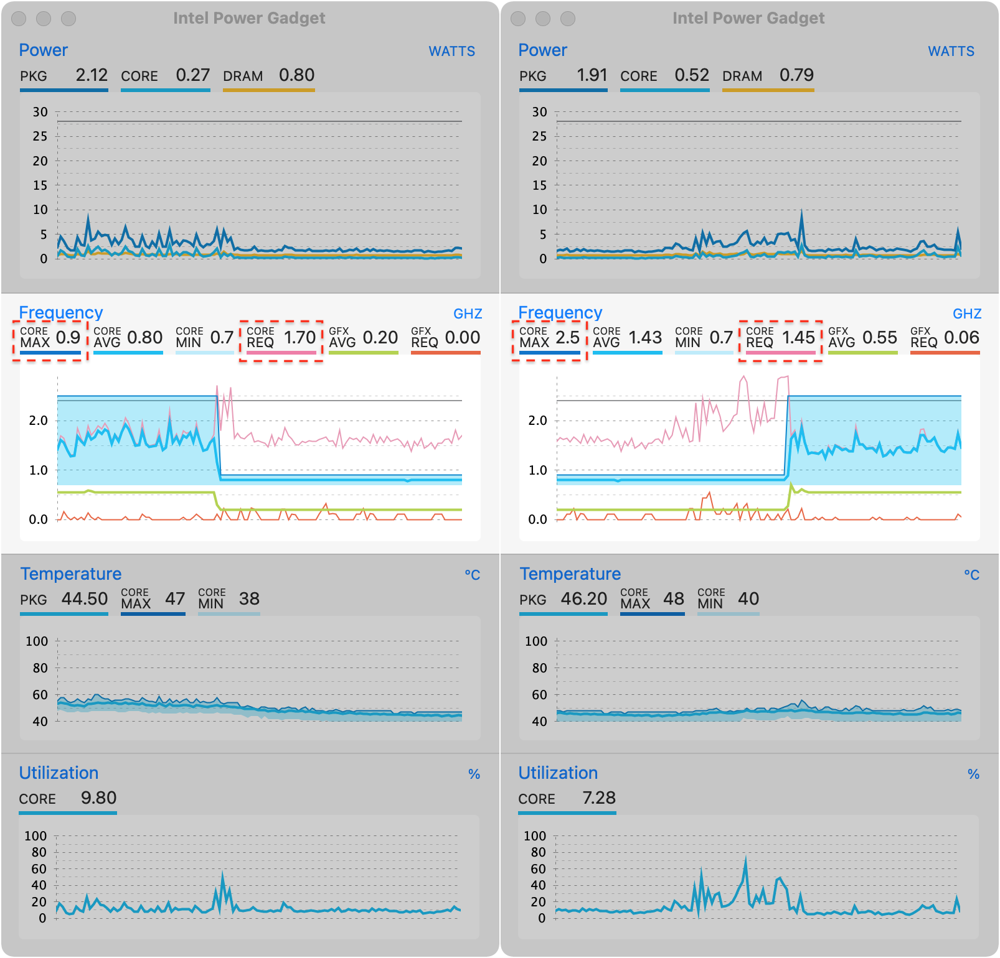

Goodbye Big Slow
==================

This kernel extension (kext) is based on [NoBatteryNoProblem.kext](https://github.com/balecrim/NoBatteryNoProblem.kext) and lets you disable the **BD PROCHOT** thermal throttling on *some* ***Intel Core*** processors running MacOS ***Big Sur***.

This program implements modification of an *undocumented* [MSR (Model-Specific Register)](https://www.intel.com/content/www/us/en/developer/articles/technical/intel-sdm.html#Intel®_64_and_IA-32_Architectures_Software_Developer's_Manual) bit responsible for [BD PROCHOT (Bi-directional Processor Hot)](https://www.intel.com/content/www/us/en/products/docs/processors/core/core-technical-resources.html) which is a signal used by peripherals to warn the CPU that they're running hot and thus initiate thermal throttling.  Apple uses this in their laptops to throttle (very, VERY agressively) their CPUs when the laptops are running with a missing/dead battery or other hardware faults.

Unlike [DisableTurboBoost.kext](https://github.com/nanoant/DisableTurboBoost.kext), this kext does not fuss with Intel® Turbo Boost Technology which dynamically increases the processor's frequency as needed by taking advantage of thermal and power headroom to give you a burst of speed when you need it, and increased energy efficiency when you don't.

You may have noticed other slowdowns by background processes like `syspolicyd`, `trustd`, `taskgated`, `WindowServer`, `MRT`, `VTDecoderXPCService` but this kext is not going to solve them.  Read this article, STFW and back up your data before risking it: https://www.naut.ca/blog/2020/11/13/forbidden-commands-to-liberate-macos/

Prerequisites
---------------

[Xcode](https://developer.apple.com/technologies/tools/) with Command Line Tools is required to compile this module.

Command Line Tools are available as extra add-on from `Preferences > Downloads` of Xcode 4.3 or newer, installer option on Xcode 4.2 or older or [separate download](https://developer.apple.com/downloads).  *Separate download does not require Xcode to build this project.*

Installation
--------------

For the impatient: skip step 2-4 by downloading [the pre-compiled kext](https://github.com/jakwings/GoodbyeBigSlow.kext/releases) and putting it into `/Library/Extensions`.

1. Run `csrutil disable` or `csrutil enable --without kext` in [Recovery Mode](https://support.apple.com/kb/HT201314).
2. Run `make` to build the kext bundle.
3. Run `make uninstall` to unload this kext.
4. Run `make install` to load this kext and de-assert `PROCHOT`.
5. Remember to check `System Preferences > Security & Privacy > General > Allow System software from developer "Unidentified - GoodbyeBigSlow"`.
6. Shut down the computer.
7. Reset the [System Management Controller (SMC)](https://support.apple.com/kb/HT201295).
8. Reboot the computer and optionally keep running `caffeinate -s` to prevent system sleep.

Repeat step 6-8 if throttling reoccurs in the future.

After installation, the modification will happen **at boot time only** unless you manually reload this kext:

    sudo kextunload -v /Library/Extensions/GoodbyeBigSlow.kext
    sudo kextload -v /Library/Extensions/GoodbyeBigSlow.kext

To build for other versions of Mac OS, try passing `MACOS_VERSION_MIN` to `make`:

    make MACOS_VERSION_MIN=10.4  # untested

Diagnostics
-------------

To find out whether your CPU has the MSR `MSR_POWER_CTL = 1FCH` if the installer is out of date:

1.  retrieve the specifications of your CPU [here](https://ark.intel.com/content/www/us/en/ark/search/featurefilter.html)
2.  download the PDF document "[Intel® 64 and IA-32 architectures software developer's manual volume 4: Model-specific registers](https://cdrdv2.intel.com/v1/dl/getContent/671098)" from https://www.intel.com/content/www/us/en/developer/articles/technical/intel-sdm.html
3.  open the PDF document, locate at the section ("2.x MSRs in ...") that matches your CPU architecture and read very carefully to which table(s) it refers and see if MSR with address `1FCH` is listed there
4.  this is all for not halting your computer by invalid read/write operation on the MSR
5.  for other CPUs, try https://github.com/calasanmarko/TurboMac or https://apple.stackexchange.com/

To view the log messages on system boot, [keep holding Command-V before you do](https://support.apple.com/kb/HT201255).

To check whether your CPU has been successfully unthrottled, install [Intel Power Gadget](https://www.intel.com/content/www/us/en/developer/articles/tool/power-gadget.html) and watch the stats:

To display the stats on the menu bar, install [MenuMeter](https://github.com/yujitach/MenuMeters) instead of some spyware-like system monitoring tools like [Stats](https://github.com/jakwings/exelban-stats-no-aggressive-user-data-collection).[app](https://github.com/exelban/stats/issues/714) [¹](https://github.com/exelban/stats/pull/858) [²](https://github.com/exelban/stats/pull/742) [³](https://github.com/exelban/stats/commit/08d8d84cebf9078d7692999c243386c887d6ee14) [⁴](https://github.com/exelban/stats/commit/c5c4e4df3db0737b749ea91f903c8cf0f1ecd6aa#data_still_sent_despite_--omit) instead.  Or you can try my fork without the stealthy behavior: https://github.com/jakwings/mac-stats/releases

When using GoodbyeBigSlow.kext, it is strongly recommended to monitor power consumption at the wall with a Kill-a-Watt meter or similar device and make sure that you don't exceed the power capabilities of your power adapter.  Use of GoodbyeBigSlow.kext to bypass this throttling scheme is at your own risk and can result in permanent damage to your power adapter or computer or both which may not be covered by your warranty.

License
---------

Copyright (c) 2012 [Adam Strzelecki](https://github.com/nanoant/DisableTurboBoost.kext)

Copyright (c) 2015 [Bernardo Alecrim](https://github.com/balecrim/NoBatteryNoProblem.kext)

Copyright (c) 2022 [Jak.W](https://github.com/jakwings/GoodbyeBigSlow.kext)

Permission is hereby granted, free of charge, to any person obtaining
a copy of this software and associated documentation files (the
"Software"), to deal in the Software without restriction, including
without limitation the rights to use, copy, modify, merge, publish,
distribute, sublicense, and/or sell copies of the Software, and to
permit persons to whom the Software is furnished to do so, subject to
the following conditions:

The above copyright notice and this permission notice shall be
included in all copies or substantial portions of the Software.

THE SOFTWARE IS PROVIDED "AS IS", WITHOUT WARRANTY OF ANY KIND,
EXPRESS OR IMPLIED, INCLUDING BUT NOT LIMITED TO THE WARRANTIES OF
MERCHANTABILITY, FITNESS FOR A PARTICULAR PURPOSE AND
NONINFRINGEMENT. IN NO EVENT SHALL THE AUTHORS OR COPYRIGHT HOLDERS BE
LIABLE FOR ANY CLAIM, DAMAGES OR OTHER LIABILITY, WHETHER IN AN ACTION
OF CONTRACT, TORT OR OTHERWISE, ARISING FROM, OUT OF OR IN CONNECTION
WITH THE SOFTWARE OR THE USE OR OTHER DEALINGS IN THE SOFTWARE.
